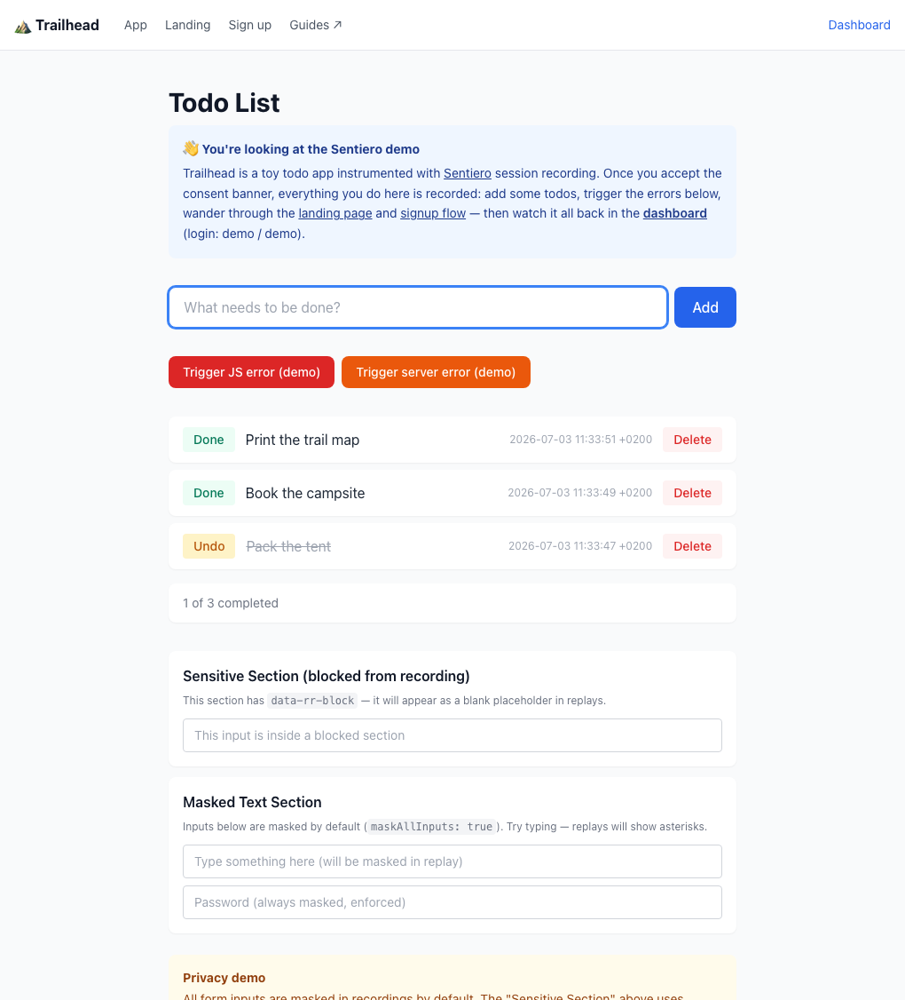
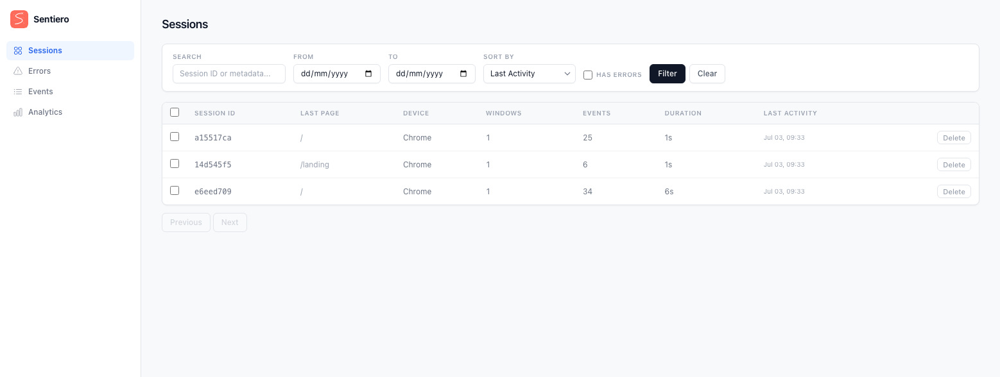
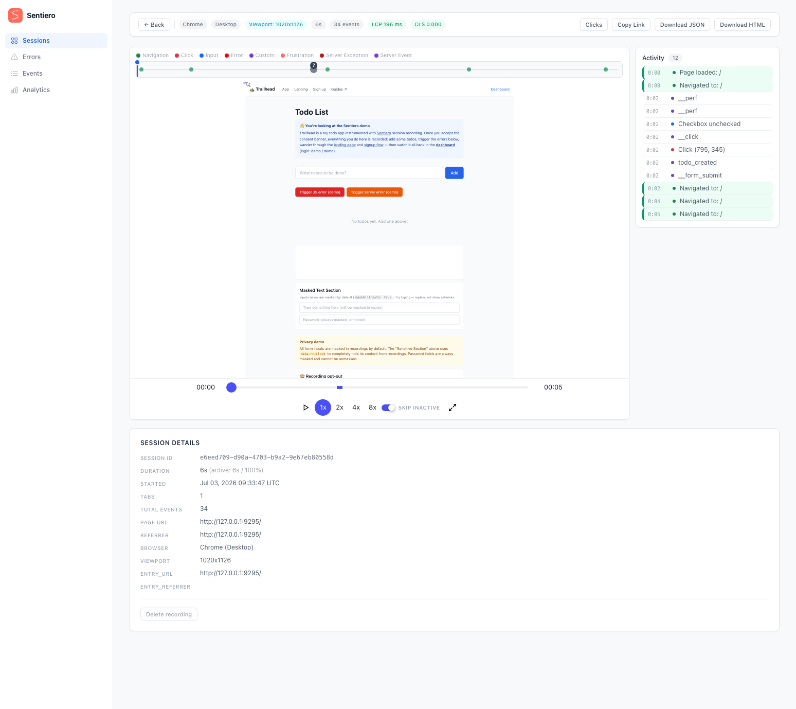

<p align="center">
  
</p>

<h1 align="center">Sentiero</h1>

<p align="center">
  <strong>In-app browser session recording and replay for Ruby.</strong><br>
  Self-hosted. Privacy-first. Framework-agnostic.
</p>

<hr/>

**Browser session recording for Ruby. Like Hotjar etc.**

Playback user journeys through your app to help debug issues, improve UX and understand intent.

Captures user interactions via [rrweb](https://www.rrweb.io/), stores them server-side with pluggable storage, and replays sessions from a built-in dashboard.

Similar to [SpectatorSport](https://github.com/bensheldon/spectator_sport) by Ben Sheldon but not bound to Rails.

**Full documentation: [sentiero.app](https://www.sentiero.app)**

**Demo: [demo.sentiero.app](https://demo.sentiero.app)** (login to dashboard with `demo`/`demo`)

### Why Sentiero?

- **De-SaaS your session recording** — keep user interaction data in your own infrastructure instead of sending it to third-party services
- **Privacy-respecting defaults** — all inputs masked by default, password masking enforced and cannot be disabled, per-element control via HTML attributes
- **User-side controls** — honors Global Privacy Control (GPC) out of the box, with support for explicit user opt-in/opt-out
- **Framework-agnostic** — drop into any Rack-compatible app, or use the dedicated Rails integration
- **Complete but focused** — session recording, replay, and the tools around them, without trying to be an analytics platform

## Features

Privacy-first defaults, no framework coupling, works with any Rack-based app.

- Replay dashboard with interactive event timeline, activity sidebar, and keyboard shortcuts
- Full DOM recording via [rrweb](https://www.rrweb.io/) with cross-tab session linking
- Privacy-first,  inputs masked by default, password masking enforced
- Works with any Rack app (Rails, Roda, Sinatra)

Also:

- Session metadata,  captures URL, browser, viewport, referrer (opt-in)
- Navigation tracking,  automatic outbound link logging (opt-in)
- Error capture,  JS errors recorded in the timeline (opt-in)
- Custom events,  imperative JS API or declarative `data-sentiero-track-*` HTML attributes ([docs](https://www.sentiero.app/guide/custom-events/))
- JSON export and shareable deep-links with timestamp
- Replay enhancers,  click overlay, scroll-depth indicator, frustration annotations (rage/dead clicks), form-interaction detail in the activity sidebar, Web Vitals badges, and a has-errors session filter
- Cross-session [Analytics](#analytics),  pages, segments, errors, heatmaps, scroll, and forms across all recorded sessions
- [Shareable replays](#shareable-replays),  export a self-contained HTML replay or play one back from JSON (opt-in)
- Privacy/compliance suite,  end-user opt-out, GPC respect, server-side sanitization, IP anonymization, retention/purge, and right-to-erasure ([see below](#compliance))
- Pluggable storage,  Memory, File, SQLite, Redis, or bring your own
- Gzip compression, smart batching, `sendBeacon` on page close, retry with backoff

> Run the [demo app](#demo-app) to see it in action: `demo/run` then visit `localhost:9292`.

| Demo app | Session list | Session replay |
|----------|-------------|----------------|
|  |  |  |

## Installation

Add to your Gemfile:

```ruby
gem "sentiero"

# Optional, pick one for persistent storage:
gem "redis", ">= 4.0"     # for Redis store
gem "sqlite3", ">= 1.4"   # for SQLite store
```

## Quick Start

### 1. Configure

```ruby
require "sentiero"

Sentiero.configure do |config|
  config.store = Sentiero::Stores::Memory.new
  config.cors_origins = ["http://localhost:3000"]
end
```

### 2. Mount the Endpoints

```ruby
# Roda (via plugin)
require "sentiero/roda"

class MyApp < Roda
  plugin :sentiero

  route do |r|
    r.on "sentiero" do
      r.on("events") { r.sentiero_events }
      r.sentiero_dashboard
    end
  end
end
```

```ruby
# Plain Rack (config.ru)
map("/sentiero/events") { run Sentiero::Web::EventsApp.new }
map("/sentiero")        { run Sentiero::Web::DashboardApp.new }
```

```ruby
# Rails (routes.rb)
mount Sentiero::Web::EventsApp.new => "/sentiero/events"
mount Sentiero::Web::DashboardApp.new => "/sentiero"
```

Two mounts are all you need: `DashboardApp` is the single dashboard entry
point and internally dispatches `/analytics/*`, `/issues/*`, `/custom-events/*`,
`/assets/*`, and `/recorder.js`. Don't mount `AnalyticsApp` or `MonitoringApp`
at their own paths alongside it — that creates routing conflicts.

> **Behind a reverse proxy?** Mount Sentiero at the same path the proxy
> forwards, and don't strip the prefix: the dashboard builds its links from
> Rack's `SCRIPT_NAME`, which `map`/`mount` set. With a prefix-stripping proxy
> (Caddy's `handle_path`, nginx `proxy_pass` with a trailing slash),
> `SCRIPT_NAME` stays empty and every internal link points at the root. Use
> Caddy's `handle` (not `handle_path`) / nginx `proxy_pass` without a URI, and
> keep the `map("/sentiero")` in your config.ru.

### 3. Add the Recording Script

Include in your HTML layout (before `</body>`):

```erb
<%= Sentiero::Web::ScriptTag.render(events_url: "/sentiero/events") %>

<%# Or with the Roda plugin helper: %>
<%= sentiero_script_tag(events_url: "/sentiero/events") %>
```

That's it. Sessions are now being recorded and viewable at `/sentiero/`.

> **Using Rails?** The `sentiero-rails` gem adds ActiveRecord storage, a migration generator, and view helpers. See [the Rails guide](https://www.sentiero.app/guide/rails/) for the full guide.

> **Going to production?** Read the [Production Checklist](#production-checklist) first.

## Authentication

**The dashboard has no authentication by default.** Anyone who can reach the URL can view and delete recorded sessions.

There are two approaches to protect it:

**1. `auth_callback`,  for session-based auth** (Devise, Warden, custom sessions):

```ruby
Sentiero.configure do |config|
  config.auth_callback = ->(env) { env["warden"]&.user&.admin? }
end
```

Denied requests get a `403 Forbidden`. This works when the user already has a session cookie,  it won't trigger a browser login dialog.

**2. Route-level auth,  for challenge-based auth** (HTTP Basic, OAuth redirects):

```ruby
# Roda example (from the demo app)
r.on "sentiero" do
  r.on("events") { r.sentiero_events }

  auth = Rack::Auth::Basic::Request.new(r.env)
  unless auth.provided? && auth.basic? && auth.credentials == [user, password]
    r.halt [401, {"www-authenticate" => 'Basic realm="Dashboard"'}, ["Unauthorized"]]
  end
  r.sentiero_dashboard
end
```

Use route-level auth when you need `401`/`302` responses (e.g., HTTP Basic prompts, OAuth redirects). `auth_callback` only returns `403`.

The events endpoint (`EventsApp`) is intentionally public,  it receives browser-generated rrweb data. Protect it with CORS (`cors_origins`), rate limiting, and payload size limits instead.

See [the authentication guide](https://www.sentiero.app/guide/authentication/) for the full guide including Rails, Sinatra, and plain Rack examples.

## Privacy

All DOM inputs are masked by default, values entered into form fields are not sent to the backend.

Password masking is **enforced and cannot be disabled**.

> **Input masking ≠ all PII.** Masking covers values the user *types*. PII the
> server *renders into the page* — `Welcome, Ada Lovelace!`, an order summary, an
> account number — is captured as ordinary DOM text. Mark those elements with
> `data-rr-mask` (mask the text) or `data-rr-block` (drop the element entirely):
>
> ```erb
> <h1 data-rr-mask>Welcome, <%= current_user.name %>!</h1>
> ```
>
> As a server-side backstop for text you can pattern-match but can't annotate,
> add a pattern to `config.redaction.custom_patterns` or a
> `config.redaction.server_proc` hook (see [Compliance](#compliance)).

You can control which inputs are masked and recorded. You can also block whole sections of content, useful for areas that may contain PII or sensitive information (user-generated content, one-time token displays, etc.).

### Per-Element Control

Use HTML attributes to control recording on individual elements:

```html
<div data-rr-block>Blocked from recording entirely</div>
<span data-rr-mask>Text content masked in replay</span>
<input data-rr-ignore> <!-- Mutations not recorded -->
<input type="password"> <!-- Always masked, enforced -->
```

### Selective Unmasking

When global masking is on (the default), you can selectively unmask specific inputs or sections with `data-sentiero-unmask`:

```html
<!-- Unmask a single input -->
<input type="text" name="search" data-sentiero-unmask>

<!-- Unmask an entire section (applies to all inputs and text within) -->
<div data-sentiero-unmask>
  <input type="text" name="first_name">
  <input type="text" name="last_name">
  <span>This text content is also unmasked</span>
</div>
```

In Rails ERB:

```erb
<%= f.text_field :search, data: { sentiero_unmask: true } %>
```

**Important:** Password inputs remain masked even with `data-sentiero-unmask`. Password masking is enforced by rrweb independently and cannot be bypassed.

**Known limitation:** Some rrweb versions don't consistently call masking functions during the initial full DOM snapshot. Pre-filled input values present on page load may appear masked in the snapshot even if marked with `data-sentiero-unmask`. Values captured from input events after page load work correctly.

### Compliance

Sentiero ships a compliance toolkit for GDPR/CCPA-style obligations:

- **End-user opt-out** — set `config.user_opt_out = true` to expose `window.Sentiero.optOut()` / `optIn()` in the browser. Opting out drops a cookie (`config.opt_out_cookie_name`, default `"sentiero_optout"`) and stops recording across sessions; the server respects the same cookie.
- **Global Privacy Control** — `config.respect_gpc` (default `true`) suppresses recording for visitors sending the GPC signal.
- **Server-side redaction** — the `config.redaction` engine scrubs events on ingest before they reach the store: builtin patterns (emails, tokens, cards), URL query handling (`url_mode`, allow/denylists), `custom_patterns` for server-rendered PII you can pattern-match, and a `server_proc` hook (the ingest-side backstop to `data-rr-mask`/`data-rr-block`). Redaction is fail-closed: an error in `server_proc` drops the batch rather than persisting unsanitized data.
- **IP anonymization** — `config.anonymize_ip` (default `true`) truncates client IPs before storage; set to `false` to keep raw IPs.
- **Data retention / purge** — set `config.retention_period` (seconds) and call `Sentiero.purge_expired!` from a scheduler, or run `rake sentiero:purge` in Rails apps.
- **Right to erasure** — `Sentiero.erase_sessions(ids)` / `Sentiero.erase_where(**filters)`, or `rake sentiero:erase` in Rails apps.
- **Audit hook** — `config.audit_log` receives compliance-relevant events (opt-outs, erasures, purges) for your own logging.

See [the privacy guide](https://www.sentiero.app/guide/privacy/) for the full privacy guide including cross-tab sessions, global recording options, and compliance details, and [Implementing Consent & Opt-Out](https://www.sentiero.app/guide/consent/) for step-by-step consent-banner, opt-out-toggle, and right-to-erasure recipes.

## Analytics

Beyond single-session replay, Sentiero includes a cross-session analytics dashboard that aggregates behavior across all recorded sessions. It's served under the dashboard mount at `/analytics`:

| Path | View |
|------|------|
| `/analytics` | Pages overview |
| `/analytics/segments` | Segments (browser, viewport, referrer, etc.) |
| `/analytics/errors` | Captured JS errors |
| `/analytics/heatmap` | Click heatmap |
| `/analytics/scroll` | Scroll-depth |
| `/analytics/forms` | Form interactions |
| `/analytics/export` | Export aggregated data |

Analytics are **compute-on-read**: there are no rollup tables, the analyzers query the store and aggregate at request time. To keep that bounded, each request scans at most `config.analytics_max_scan_sessions` sessions (default `5000`).

DashboardApp serves these routes automatically. To mount the analytics UI on its own, use the Roda helper `r.sentiero_analytics`.

See [the analytics guide](https://www.sentiero.app/guide/analytics/) for details.

## Shareable Replays

You can hand a single session to someone who has no access to your dashboard:

- **HTML export** — `GET /analytics/share/:id` produces a standalone, self-contained HTML file that replays the session with no server needed.
- **JSON import** — `/analytics/import` plays a session back from a previously exported JSON dump.

Both are gated by `config.shareable_replays` (default `false`); while disabled, the routes return `404`.

> **Security:** a share file is a full session dump that leaves your infrastructure. Treat it like any other export of recorded data and only enable sharing if that's acceptable for your privacy posture.

See [the sharing guide](https://www.sentiero.app/guide/sharing/) for details.

## Server-side Error Tracking

Sentiero ships a server-side **reporter** that sends unhandled exceptions and
custom events to a Sentiero ingest endpoint, where they are fingerprinted into
issues. When a server error happens during a recorded session, the reporter
links it back to the front-end replay via the `sentiero_sid` / `sentiero_wid`
cookies, so you can watch what the user did right before it broke.

The reporter is **fail-safe**: every public method rescues internally and never
raises into your app.

### Install

The reporter lives in the same gem, but isn't required by default. Require it
where you configure it (the Rails initializer does this for you):

```ruby
require "sentiero/reporter"
```

### Configure

```ruby
Sentiero::Reporter.configure do |r|
  r.endpoint = ENV["SENTIERO_ENDPOINT"]      # e.g. "https://sentiero.example.com"
  r.ingest_key = ENV["SENTIERO_INGEST_KEY"]  # server-issued ingest key
  r.project = "my-app"                        # project identifier
  r.environment = "production"                 # added to every report's context
  r.release = ENV["GIT_SHA"]                  # optional release/version

  r.ignore_exceptions = [ActiveRecord::RecordNotFound, "ActionController::RoutingError"]
  r.before_notify = ->(report) {
    report["context"].delete("secret")
    report                                     # return false/nil to drop the report
  }
  r.filter_keys = [:password, :token, /secret/i]
end
```

The reporter is **active** only when `endpoint`, `ingest_key`, and `project` are
all set and `enabled` is true (the default). Until then, `notify`/`track` are
no-ops.

### Report errors and events

```ruby
# Report a caught exception
begin
  risky!
rescue => e
  Sentiero::Reporter.notify(e, context: { user_id: current_user.id })
  raise
end

# Track a custom event (a non-error business signal)
Sentiero::Reporter.track("signup", level: "info", plan: "pro")
```

### Context

Attach context once and have it merged into every report from the current
thread:

```ruby
Sentiero::Reporter.add_context(user_id: 42)            # sticky for this thread

Sentiero::Reporter.with_context(request_id: "abc") do  # scoped to the block
  Sentiero::Reporter.notify(error)
end

Sentiero::Reporter.clear_context
```

Putting `session_id` / `window_id` in context (the Rack middleware does this
from the recorder cookies) links the report to a session replay.

### Filtering noise

- `ignore_exceptions` — an array of exception classes or `"String"` class-names;
  matches the exception class **or any ancestor**, so a subclass of an ignored
  error is also dropped.
- `before_notify` — a proc called with the assembled, mutable report hash. Mutate
  it in place to enrich/redact, or return `false`/`nil` to drop the report. A
  raising hook is caught and the original report is delivered unchanged.

### Transports

By default the reporter posts JSON to your endpoint. For development/test you
can swap the transport:

```ruby
r.transport = Sentiero::Reporter::LogTransport.new   # logs would-be deliveries
r.transport = Sentiero::Reporter::NullTransport.new  # drops everything
```

In your own test suite, capture what would have been sent. The helper is not
loaded by default — require it from your test setup:

```ruby
require "sentiero/reporter/test_helper"

captured = Sentiero::Reporter::TestHelper.capture_notifications do
  do_something_that_reports
end
# => [["errors", {...}], ["track", {...}]]
```

### Rails auto-install

With `sentiero-rails`, configuring the reporter is all you need — the engine
auto-inserts `Sentiero::Reporter::Middleware` into your middleware stack (it
captures and re-raises unhandled exceptions, and reads the session/window
cookies into context). Opt out with `Sentiero::Rails.configure { |c| c.reporter_middleware = false }`.
For non-Rails apps, add the middleware yourself: `use Sentiero::Reporter::Middleware`.

See [the error tracking guide](https://www.sentiero.app/guide/error-tracking/) for the full guide
(architecture, the `/issues` and `/custom-events` dashboards, deployment, and
the Crystal shard).

## Configuration

```ruby
Sentiero.configure do |config|
  # Storage backend (required)
  config.store = Sentiero::Stores::Redis.new(
    redis: Redis.new(url: ENV["REDIS_URL"]),
    ttl: 86_400 * 7,     # auto-expire after 7 days
    prefix: "sentiero:"   # Redis key namespace
  )

  # CORS origins for the events endpoint
  config.cors_origins = ["https://mysite.com"]

  # Dashboard auth (receives Rack env, return truthy to allow)
  config.auth_callback = ->(env) { env["rack.session"]&.dig("admin") }

  # Frontend flush tuning
  config.flush_interval_ms = 10_000       # time-based flush (ms), default: 10,000
  config.flush_event_threshold = 50       # count-based flush, default: 50
  config.max_events_per_page = 1_000      # events API pagination, default: 1,000

  # Resource limits (nil = unlimited)
  config.max_events_per_request = 500     # max events in a single POST
  config.max_sessions = 10_000            # max sessions in store (LRU eviction)
  config.max_events_per_session = 50_000  # max events per session (oldest dropped)

  # Cross-tab session linking (default: true)
  # When true, all tabs share a session ID (via localStorage).
  # When false, each tab gets its own session (via sessionStorage).
  config.cross_tab_sessions = true

  # Opt-in features (all default: false)
  config.capture_metadata = true      # capture URL, browser, viewport, referrer
  config.capture_errors = true        # capture JS errors as timeline events
  config.track_navigation = true      # log outbound link clicks as events
  config.track_custom_events = true   # enable declarative data-sentiero-track-* attributes
  config.track_forms = true           # capture real form submits for form analytics (attrs only, never values)

  # rrweb recorder options (Ruby-style snake_case)
  config.mask_all_inputs = true                       # default: true
  config.block_selector = "[data-rr-block]"           # default: "[data-rr-block]"
  config.mask_text_selector = "[data-rr-mask]"        # default: "[data-rr-mask]"
  config.ignore_selector = "[data-rr-ignore]"         # default: "[data-rr-ignore]"
  config.sampling = { scroll: 150, input: "last" }    # default shown
  config.inline_stylesheet = true                     # default: nil (rrweb default)
  config.checkout_every_n_ms = 30_000                 # default: nil (rrweb default)

  # Escape hatch for rrweb options without a first-class attribute.
  # Pass camelCase keys; they're forwarded to rrweb verbatim.
  # First-class attributes above take precedence for overlapping keys.
  config.recorder_options = { someObscureOption: true }
end
```

| Option | Type | Default | Description |
|--------|------|---------|-------------|
| `store` | `Sentiero::Store` | `nil` (required) | Storage backend instance |
| `cors_origins` | `Array<String>` | `[]` | Allowed CORS origins for EventsApp |
| `auth_callback` | `Proc` / `nil` | `nil` | Dashboard auth; `nil` = open access |
| `flush_interval_ms` | `Integer` | `10_000` | Frontend time-based flush interval |
| `flush_event_threshold` | `Integer` | `50` | Frontend count-based flush threshold |
| `max_events_per_page` | `Integer` | `1_000` | Max events returned per API page |
| `max_events_per_request` | `Integer` / `nil` | `nil` | Max events accepted per POST; `nil` = unlimited |
| `max_sessions` | `Integer` / `nil` | `nil` | Max sessions in store; oldest evicted when exceeded; `nil` = unlimited |
| `max_events_per_session` | `Integer` / `nil` | `nil` | Max events per session; oldest dropped when exceeded; `nil` = unlimited |
| `cross_tab_sessions` | `Boolean` | `true` | Link sessions across browser tabs; `false` isolates each tab as its own session |
| `session_idle_timeout` | `Integer` | `21_600` (6 h) | Inactivity gap (seconds) after which a returning visitor starts a new session |
| `session_max_age` | `Integer` | `604_800` (7 d) | Hard cap (seconds) on a session ID's lifetime, even while continuously active |
| `capture_metadata` | `Boolean` | `false` | Capture page URL, browser, viewport, and referrer per session |
| `capture_errors` | `Boolean` | `false` | Capture JS errors and unhandled promise rejections as timeline events |
| `track_navigation` | `Boolean` | `false` | Automatically log outbound link clicks as custom events |
| `track_custom_events` | `Boolean` | `false` | Enable declarative `data-sentiero-track-*` HTML attributes for custom events ([docs](https://www.sentiero.app/guide/custom-events/)) |
| `track_forms` | `Boolean` | `false` | Capture real form submits as `__form_submit` events for form analytics (form `name`/`id` attributes + page URL — never values) |
| `mask_all_inputs` | `Boolean` | `true` | Mask all form input values in recordings |
| `mask_input_options` | `Hash` | `{}` | Per-input-type masking; `password: true` is always enforced |
| `block_selector` | `String` / `nil` | `"[data-rr-block]"` | CSS selector for elements excluded from recording |
| `mask_text_selector` | `String` / `nil` | `"[data-rr-mask]"` | CSS selector for elements with masked text content |
| `ignore_selector` | `String` / `nil` | `"[data-rr-ignore]"` | CSS selector for elements whose mutations are ignored |
| `sampling` | `Hash` / `nil` | `{ scroll: 150, input: "last" }` | Throttling for scroll/input events |
| `inline_stylesheet` | `Boolean` / `nil` | `nil` | Inline stylesheets into the recording snapshot |
| `checkout_every_n_ms` | `Integer` / `nil` | `nil` | Full DOM checkout interval in milliseconds |
| `recorder_options` | `Hash` | `{}` | Escape hatch: raw camelCase rrweb options forwarded verbatim; first-class attributes above take precedence for overlapping keys |
| `capture_web_vitals` | `Boolean` | `false` | Capture Web Vitals (LCP, CLS, etc.) and show them as badges in replay |
| `analytics_max_scan_sessions` | `Integer` | `5000` | Max sessions scanned per compute-on-read analytics request |
| `shareable_replays` | `Boolean` | `false` | Enable HTML-export and JSON-import share routes; `false` makes them `404` |
| `user_opt_out` | `Boolean` | `false` | Expose `window.Sentiero.optOut()` / `optIn()` and honor the opt-out cookie |
| `opt_out_cookie_name` | `String` | `"sentiero_optout"` | Cookie name used to persist an end-user opt-out |
| `respect_gpc` | `Boolean` | `true` | Suppress recording for visitors sending a Global Privacy Control signal |
| `retention_period` | `Integer` / `nil` | `nil` | Retention window in seconds for `purge_expired!`; `nil` = keep forever |
| `redaction` | `Redaction::Config` | builtin defaults | Client+server redaction engine (`url_mode`, `custom_patterns`, `server_proc`); fail-closed |
| `anonymize_ip` | `Boolean` | `true` | Truncate client IP addresses before storage |
| `audit_log` | `Proc` / `nil` | `nil` | Hook receiving compliance events (opt-outs, erasures, purges) |

### Reporter configuration (`Sentiero::Reporter.configure`)

These keys live on `Sentiero::Reporter::Configuration`, not the recorder config above.

| Option | Type | Default | Description |
|--------|------|---------|-------------|
| `endpoint` | `String` / `nil` | `nil` | Ingest base URL; required for the reporter to be active |
| `ingest_key` | `String` / `nil` | `nil` | Bearer ingest key; required for the reporter to be active |
| `project` | `String` / `nil` | `nil` | Project identifier; required for the reporter to be active |
| `environment` | `String` / `nil` | `nil` | Added to every report's context |
| `release` | `String` / `nil` | `nil` | Release/version added to every report's context |
| `enabled` | `Boolean` | `true` | Master switch; `false` makes `notify`/`track` no-ops |
| `ignore_exceptions` | `Array<Class, String>` | `[]` | Exceptions to drop, matched by class/ancestor or class-name string |
| `before_notify` | `Proc` / `nil` | `nil` | Hook to mutate the report hash or drop it (return `false`/`nil`) |
| `filter_keys` | `Array<String, Symbol, Regexp>` | `[]` | Context/payload keys to redact before sending |
| `async` | `Boolean` | `true` | Deliver via background queue; `false` delivers synchronously |
| `max_queue` | `Integer` | `100` | Max queued payloads before new ones are dropped (async) |
| `transport` | object / `nil` | `nil` | Custom transport (`post(path, payload)`); `nil` = `HttpTransport` |
| `open_timeout` | `Integer` | `2` | HTTP open timeout (seconds) |
| `read_timeout` | `Integer` | `3` | HTTP read timeout (seconds) |
| `session_cookie_name` | `String` | `"sentiero_sid"` | Cookie read for session-replay linkage |
| `window_cookie_name` | `String` | `"sentiero_wid"` | Cookie read for session-replay linkage |

Rails-only: `Sentiero::Rails.configure { |c| c.reporter_middleware = ... }` (default `true`) controls the middleware auto-install.

## Production Checklist

Before deploying Sentiero to production, review each of these:

| Concern | Action |
|---------|--------|
| **HTTPS** | Always serve over HTTPS in production |
| **Dashboard auth** | Set `auth_callback`, without it, the dashboard is open to anyone |
| **Privacy compliance** | Review recording options for your jurisdiction; add `data-rr-block` to sensitive sections |
| **Encryption at rest** | Enable at the storage layer if recording sensitive pages |
| **Resource limits** | Set `max_events_per_request`, `max_sessions`, and `max_events_per_session` to prevent unbounded memory growth |
| **Rate limiting** | Add [Rack::Attack](https://github.com/rack/rack-attack) or nginx rate limiting on the events endpoint |
| **Store** | Use Redis with TTL or SQLite in production; Memory and File stores are for dev/small deployments |
| **CORS** | Set `cors_origins` to your frontend's origin(s) |

## Storage Backends

### Memory (dev/test)

```ruby
config.store = Sentiero::Stores::Memory.new
```

In-memory storage using `concurrent-ruby` thread-safe primitives. Data is lost on restart.

### File (dev/small deployments)

```ruby
require "sentiero/stores/file"

config.store = Sentiero::Stores::File.new(path: "tmp/sentiero_sessions")
```

Stores sessions as JSON files on disk — one directory per session, one `.jsonl` file per window. Persists across restarts with zero dependencies. Not suitable for high-concurrency production use.

| Parameter | Type | Default | Description |
|-----------|------|---------|-------------|
| `path` | `String` | (required) | Directory path for session data |

### SQLite (single-server production)

```ruby
require "sentiero/stores/sqlite"

config.store = Sentiero::Stores::SQLite.new(path: "sentiero.db")
```

Single-file database with WAL mode. Good for single-process production and small deployments without external services. Requires the `sqlite3` gem.

| Parameter | Type | Default | Description |
|-----------|------|---------|-------------|
| `path` | `String` | `"sentiero.db"` | Database file path (use `":memory:"` for in-memory) |

### Redis (production)

```ruby
require "sentiero/stores/redis"

config.store = Sentiero::Stores::Redis.new(
  redis: Redis.new(url: "redis://localhost:6379/0"),
  ttl: 86_400,          # optional, seconds
  prefix: "sentiero:"   # optional, default: "sentiero:"
)
```

Requires the `redis` gem.

| Parameter | Type | Default | Description |
|-----------|------|---------|-------------|
| `redis` | `::Redis` | (required) | Connected Redis client |
| `ttl` | `Integer` / `nil` | `nil` | TTL in seconds applied to all keys; `nil` = no expiry |
| `prefix` | `String` | `"sentiero:"` | Key namespace prefix |

### Custom Store

Implement the methods defined in `Sentiero::Store` and verify with the shared contract tests.

See [the storage guide](https://www.sentiero.app/guide/storage/) for details on all backends, Redis data structures, and building custom stores.

## Security

Sentiero has undergone multiple review passes covering XSS, CSRF, Redis key poisoning, gzip bomb attacks, payload-based OOM vectors, and other common vulnerability classes.

However, this is a new release and has not yet been battle-tested or reviewed by a 3rd party expert.

I can't obviously guarantee the absence of undiscovered vulnerabilities.

If you discover a security issue, please report it privately via [GitHub Security Advisories](https://github.com/stevegeek/sentiero/security/advisories/new), do not open a public issue. See [SECURITY.md](SECURITY.md) for full details, including a list of areas already reviewed.

## Demo App

A Roda todo list app demonstrating full Sentiero integration with privacy features and dashboard auth.

```bash
demo/run              # Install deps + start server on :9292
demo/run help         # See all commands
demo/run stop         # Stop the server
```

- **Todo app**: http://localhost:9292
- **Dashboard**: http://localhost:9292/sentiero/dashboard/ (credentials: `demo` / `demo`)
- Configurable via `demo/.env` (defaults) and `demo/.env.development` (local overrides)
- Set `REDIS_URL` in `.env.development` to use Redis; omit for File store (auto-fallback on connection failure, persists across restarts)

## Development

### Setup

```bash
bin/dev up            # Start Redis via Docker
bin/dev down          # Stop services
bin/dev console       # Open redis-cli
```

### Frontend Build

The recorder JS is pre-built and vendored in the gem. You only need this if modifying the frontend source:

```bash
cd frontend && npm install && npm run build
# Output: lib/sentiero/web/assets/vendor/recorder.js
```

See [the recorder guide](https://www.sentiero.app/guide/recorder/) for details on the frontend recorder's batching, compression, and retry behavior.

### Testing

```bash
bin/dev test                                              # Start Redis + run all tests
bundle exec rake test                                     # All tests (Redis must be running)
bundle exec rake test TEST=test/stores/memory_test.rb     # Single file
```

**Store contract tests** verify any store implementation against the required interface. Include `StoreContractTests` in your test class and implement `create_store`.

**Redis tests** skip automatically when Redis is unavailable.

## Alternatives

Sentiero was initially inspired by [SpectatorSport](https://github.com/bensheldon/spectator_sport) by Ben Sheldon. 

It was the first `rrweb` session recording gem I saw for Ruby, but I needed something but not bound to Rails.

Go check out `spectator_sport` too.

## Thanks

Powered by [rrweb](https://www.rrweb.io/).

Coded by Claude Code and Stephen Ierodiaconou.

## License

[MIT](LICENSE.txt) - Copyright 2026 Stephen Ierodiaconou
